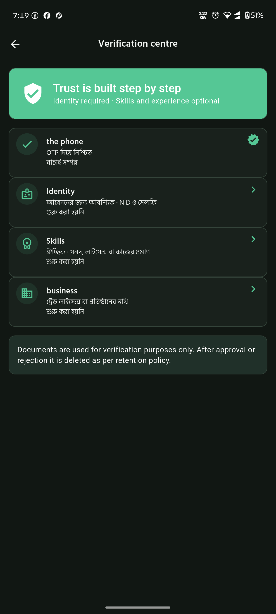
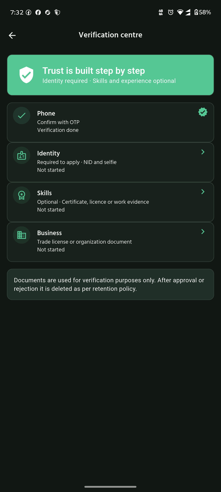

# KAAJ application audit — 3 October 2026

Follow-up: backend commit `94adf43` has since been deployed and 13 safe live checks passed.
See [deployment record](production-deployment-2026-10-03.md). The audit results below describe
the original test pass; its “not deployed” statements are historical, not current backend status.

## Decision and scope

**Not yet approved for unrestricted public production launch.** This audit pass found and corrected reproducible session, API, localization and UI defects. It exercised critical workflows against disposable databases and the existing authenticated Android staging app. It is not a claim that every screen permutation, carrier transaction, device, or production integration has been tested.

Client checkout: Kaaj, branch `codex/production-hardening`. Backend/admin checkout: `/home/sufyan/kaaj-production-backend`, branch `codex/production-readiness`, based on `6cdb270`. Earlier password-auth edits were preserved. The fixes in this report are local, uncommitted and **not deployed to the production backend/admin**.

No production jobs/applications were created, no real NID documents uploaded, no paid OTP requested, and no subscription pricing/access rules changed. Successful device credential entry was not performed by this audit: the phone already had an authenticated session. Existing production app data was not cleared.

## Architecture and feature inventory

Discovery identified 45 Flutter GoRoute declarations, 168 backend HTTP method declarations and 66 Prisma models. These are inventory counts, not coverage percentages.

| Layer | Existing implementation / responsibilities | Audit evidence |
| --- | --- | --- |
| Android/Flutter | Riverpod state, GoRouter, Dio, secure session tokens, local onboarding/preferences, Bangla/English catalogs | Full test suite, analyzer, device navigation, selected 360/480 px and 200% text widget tests |
| Authentication | Carrier OTP, password setup/login, paid recovery, refresh rotation, logout/session revocation | Real-database auth tests; added network/session regressions; no new live carrier transaction |
| Discovery | Categories/subtypes, local-area/job filters, worker profiles, saved workers, availability | Device worker grid and Education → Tutoring → filtered empty results; repository/widget/API tests |
| Jobs | Draft/publish, applications, acceptance, confirmation, work submission/completion, recurring work | New real HTTP + PostgreSQL lifecycle test; existing recurrence, availability and policy tests |
| Trust and profiles | NID/selfie, optional skill verification, portfolio, ratings/badges, reports, blocks | Phone verification centre; upload/verification/policy tests; no production document upload |
| Payments/subscriptions | Carrier gateway, operator status, access decision, local plans, manual/cash job records | Adapter and money database tests; read-only phone subscription page; billing preserved |
| Communication | Inbox, preferences, conversation/socket services | Phone empty inbox/messages; automated notification/chat tests; external push not implemented |
| Admin | Next.js operations console and server-side API proxy/session routes | Production build/typecheck, 8 Playwright workflows with mocked responses |
| Persistence | Prisma/PostgreSQL, Redis, private object-storage adapters | All migrations and seed on new isolated database only; real database workflow tests |
| Background work | Assignment/dispute lifecycle, hourly recurrence, reputation, daily risk scan and verification-document purge | Runner/service source review and existing tests; no long-running production soak |

Data path: Flutter input → validation/controller → Dio + access token → Nest policy/DTO/service → Prisma transaction/Redis/provider → API envelope → repository/domain model → UI state. Admin uses server-side routes to reach the same backend. Paid OTP and external object storage are integration boundaries, not equivalent to local unit-test success.

## Device journey and screenshot evidence

Phone: connected Motorola edge 60 fusion, 1220 × 2712. Package: `app.kaaj.mobile.staging`. Screenshots below are from this audit, not old design references.

1. **Home and navigation — usable, localization defect found.** Bangla dashboard cards rendered; hidden navigation accessibility labels were English. Labels now use the existing centralized localization. [Home](audit-evidence/2026-10-03/03-home-bn.png).
2. **Worker discovery — incomplete-profile defect found.** Directory loaded, but an existing incomplete profile produced blank name/area. Neutral localized fallbacks added without renaming users or hiding profiles. [Before](audit-evidence/2026-10-03/05-worker-discovery.png).
3. **Notifications — empty state works, delivery not certified.** Filters and empty inbox render; OS notification permission is disabled. Backend supports only the disabled push provider, so enabling phone permission alone does not prove push delivery. [Inbox](audit-evidence/2026-10-03/06-notifications.png).
4. **Settings/language — selected path passed.** Switching Bangla → English changed visible settings; English persisted after force-stop/relaunch. [English settings](audit-evidence/2026-10-03/08-settings-en.png). This does not certify every dynamic server-generated message.
5. **Subscription — release blocker remains.** Phone showed inactive local subscription, pilot marketplace access, operator verified, and no active plans. No subscribe/cancel/OTP action executed. [Current state](audit-evidence/2026-10-03/09-subscription-en.png).
6. **Verification — mixed-language defect fixed locally.** English screen contained Bangla step descriptions/statuses because several messages were joined before dictionary lookup. Translate separate widgets instead; widget tests scroll the screen in both languages at 200% text.
7. **Job posting — empty submission blocked; messages corrected.** Blank publish exposed Bangla validation in English mode. Shared validator results and category errors now localize. English pay label corrected from “Rs.” to BDT. Removed fixed “Step 1 / 3” progress because this is a single-page publish form. No job created. [Before](audit-evidence/2026-10-03/11-job-form-en.png).
8. **Messages and assignments — empty paths passed only.** Both screens loaded and explained missing activity. Real two-phone messaging and populated assignment UI remain untested on hardware. [Messages](audit-evidence/2026-10-03/12-messages-en.png), [Assignments](audit-evidence/2026-10-03/13-assignments-en.png).
9. **Type/subtype discovery — selected path passed.** Work types → Education → Tutoring opened the correctly labeled filtered listing with an empty state. No suitable jobs existed in that live result; application submission was tested only in the isolated lifecycle. [Result](audit-evidence/2026-10-03/14-tutoring-filter-en.png).

### Verification before correction

### Verification after correction, on the connected phone

[Corrected English job validation and BDT label](audit-evidence/2026-10-03/15-job-validation-fixed-en.png) were also rechecked on the installed staging build.

The final worker-card recheck confirms English fallback labels and job counts: [final worker directory](audit-evidence/2026-10-03/18-workers-final-en.png).

The product-audit method influenced the fixes: capture actual device states, reproduce the issue at the responsible boundary, add targeted regression tests, and distinguish empty-state navigation from completed business transactions.

## Issue register

| ID / severity | Reproduction; expected versus actual | Root cause / action | Verification / status |
| --- | --- | --- | --- |
| A01 High | Expired access token; refresh succeeds; replay returns 401/403/500. Expected completion with correct error; request could hang. | Queued error interceptor awaited its own queued replay. Use non-queued interceptor while retaining shared in-flight refresh. | New timeout-bounded regressions failed before and pass after; fixed locally. |
| A02 High | Refresh endpoint returns 503 or startup profile load fails transiently. Expected retry without losing credentials; previous code cleared session. | Broad catch treated all errors as revoked credentials. Clear only unauthorized sessions; preserve transient failures and expose startup retry. | Repository/controller and API regression tests pass; fixed locally. |
| A03 Medium | Submit same worker application twice. Expected 409 and one application; actual 500 from unique constraint. | Unhandled Prisma P2002. Preserve transaction/constraint and map duplicate to conflict. | Real HTTP/database regression confirms 409 and count 1; fixed locally. |
| A04 Medium | GET workers with non-UUID skill/location. Expected 400; actual 500. | Untyped query strings reached Prisma. Added optional UUID DTO validation. | Live read-only reproduction and isolated regressions; fixed locally, live remains unpatched. |
| A05 Medium | English verification centre shows Bangla subtitles/status. | Composite dictionary lookup could not match individual entries. Split text and add reviewed translations. | Both-language, 200% text scroll tests pass; fixed locally. |
| A06 Medium | English empty job publish shows Bangla field errors. | Shared input passed raw validator output; dropdown also returned raw text. | Both-language invalid-form tests pass; fixed locally. |
| A07 Low | Incomplete worker card has no name/area text. | Empty/whitespace fields had no meaningful fallback. | Both-language worker-card tests at 200% pass; fixed locally. |
| A08 Medium | Bangla home exposes English navigation accessibility labels. | Hardcoded destination labels. | Both-language destination-label assertions pass; fixed locally. Full TalkBack audit not performed. |
| A09 Low | Single-page job form says Step 1/3; English pay label says Rs. | Static mock-style progress and poor catalog copy. Removed false progress, corrected BDT/Start/End/Post a job copy. | Form/widget tests pass; fixed locally. |
| A10 Medium | Admin headless dev page remains loader/blank; 6 browser flows fail. | Dev-origin mismatch with 127.0.0.1 after Next update. Add explicit local allowedDevOrigins entry. | All 8 Playwright tests pass; production build/typecheck pass. |
| A11 High | Production dependency audit reported 52 findings including 2 critical. | Vulnerable installed versions plus hidden advisory suppressions. Applied targeted updates, removed suppressions. | Now 0 critical, 1 high, 3 moderate. **Partially resolved**, not a clean security audit. |
| A12 High / launch | Subscription page has no plans and access remains in pilot mode. | Existing operational/billing configuration, intentionally preserved. | Confirmed on phone. Needs separately authorized billing reconciliation and carrier acceptance tests. |
| A13 High / launch if push promised | Inbox exists but real external push cannot be demonstrated. | PUSH_PROVIDER schema only accepts disabled. | Source confirmed. No claim of real push delivery; implementation/configuration remains open. |
| A14 Medium | Valid job form with missing local location silently returns from save. | Location guard returned without feedback. Added an explicit localized instruction to choose an area in the profile. | Both-language widget tests invoke publish and assert the prompt without API access; fixed locally. No live valid job posted. |
| A15 Medium | Final combined run had one password-reset test timeout. | Five-second test budget exceeded under simultaneous builds; resource contention suspected, not proven. | 311 pass/1 timeout, then unchanged full rerun 312 pass in 24.2 s. Keep as test-reliability risk. |
| A16 Low | English worker card still showed Bangla job-count suffix on device. | Dynamic formatter did not recognize the rating/count template. Added a narrowly anchored system-copy pattern, preserving authored content. | Added English/Bangla count regressions and card assertion; fixed locally. |

## Fix summary

No schema changes or migrations were introduced by this audit.

Client changes: session interceptor; auth restoration repository/controller; splash retry UI; shared text-field validator localization; home navigation labels; worker-card fallbacks/count; job form labels/progress/missing-area feedback; verification text composition; reviewed translation catalog.

Added/extended client tests: `test/core/api_client_test.dart`, `test/core/localization_policy_test.dart`, `test/features/auth/session_restore_test.dart`, `test/widget/grid_card_alignment_test.dart`.

Backend changes: jobs duplicate-application exception handling; public profile controller and new `WorkerDirectoryQueryDto`; public-profile validation tests; new `marketplace-audit.prisma.e2e-spec.ts`.

Admin/dependency changes: local dev origin; Next 16.3.8; Playwright 1.55.1; sharp 0.35.5; overrides for js-yaml 4.3.2, multer 2.4.0, qs 6.16.0, engine.io 6.6.11 and postcss 8.5.28; lockfile; removal of advisory suppressions. Next generated its agent guidance and route-type references. No major Nest/Prisma upgrade forced.

## Executed verification

| Check | Final result | Evidence / boundary |
| --- | --- | --- |
| Flutter complete suite | **146 passed** | [Log](audit-evidence/2026-10-03/kaaj-audit-flutter-final3.log); baseline 130 |
| Flutter analyzer | **No issues** | [Log](audit-evidence/2026-10-03/kaaj-audit-flutter-analyze-final.log) |
| Backend Jest with real-DB gates enabled | **312 passed, 56 suites** | [Log](audit-evidence/2026-10-03/kaaj-audit-backend-final-retry.log); includes auth, money, trust, dispute, attendance, moderation, risk |
| Admin Playwright | **8 passed** | [Log](audit-evidence/2026-10-03/kaaj-audit-admin-e2e-retry.log); mocked APIs, not live admin writes |
| Workspace tooling | **6 passed** | [Log](audit-evidence/2026-10-03/kaaj-audit-workspace-tests.log) |
| Backend typecheck/build | Passed | Local Nest/TypeScript build |
| Admin typecheck/build | Passed | [Build log](audit-evidence/2026-10-03/kaaj-audit-admin-build-final.log) |
| Backend/admin package lint | Passed | Backend Prettier check and admin TypeScript check |
| Android arm64 staging release | Built and installed successfully, 25.7 MB | Updated existing staging package without uninstall/data reset; original production package untouched |
| Production dependency audit | **Still fails security gate** | 1 high + 3 moderate; no suppressions |
| Diff whitespace check | Passed both checkouts | Not a substitute for all-repository style review |

Important test history: first backend baseline was 305 pass/3 fail because local environment overrode mocked S3/bdApps settings. Correcting only the test runner produced 308/308. New duplicate/filter regressions then reproduced 3 failures before fixes. Refresh replay regressions reproduced hangs; startup regression reproduced credential deletion. These failures were not hidden by deleting tests.

The new marketplace test exercises create → publish → apply → accept → confirm → submit → complete over HTTP with real PostgreSQL. It checks unauthorized publish/detail access, too-early submission, completed state, contract creation, notification rows, and duplicate application count. Time advancement uses fixture database updates only. It does not prove carrier billing, external push or rendered mobile success states.

Disposable PostgreSQL/Redis used ports 55432/56379, separate from all existing services. External SMS/operator/push providers were disabled or mocked. Admin tests ran in a separate approved headless browser. Existing user Chrome sessions were not used for mutations. After testing, only the two audit containers and their synthetic-data volumes were removed; all pre-existing services were left intact. Temporary screenshots containing personal login/notification content were discarded, not included in this report.

## Remaining dependency exposure

- `file-type@20.4.1` enters through Nest common. Two parser denial-of-service advisories remain: [ASF loop](https://github.com/sindresorhus/file-type/security/advisories/GHSA-5v7r-6r5c-r473), [ZIP decompression](https://github.com/sindresorhus/file-type/security/advisories/GHSA-j47w-4g3g-c36v). No direct FileTypeValidator/ParseFilePipe/file-type call was found in backend source; that is a limited reachability observation, not proof of no exploit.
- `@nestjs/core@10.4.22`: [SSE field injection advisory](https://github.com/nestjs/nest/security/advisories/GHSA-36xv-jgw5-4q75), patched in 11.1.18. No application SSE route was found. Socket.IO is a different transport.
- `deepmerge-ts@7.1.5` enters through Prisma config: [recursive merge stack exhaustion](https://github.com/RebeccaStevens/deepmerge-ts/security/advisories/GHSA-ggr8-5vv4-36mx), patched in 8. No direct request-to-merge path was found.

Recommendation: planned compatible framework/toolchain upgrades and regression tests, or documented security-owner risk acceptance before launch. No adversarial payloads were sent to production.

## Priorities and coverage limits

**Critical before public launch**

- Reconcile carrier status, local subscription records, plan availability and intended access enforcement with explicit owner authorization; preserve existing price and rules.
- Resolve or formally accept the remaining dependency advisories based on verified reachability.
- Deploy reviewed backend/admin fixes and validate the exact release artifact; local fixes do not fix deployed servers.
- Exercise real carrier registration/recovery/cancellation and renewal evidence with a controlled number and fresh charge consent. None performed here.
- Verify NID/selfie upload → private storage → reviewer access → retention deletion on a controlled environment, without real identity documents.

**Important**

- Implement and validate external push delivery or clearly scope launch to in-app notifications.
- Compare all create/publish validation bounds; rejected publication already reports that a draft was saved, but prevention can reduce user rework.
- Two-device messaging/reconnection; offline/startup retry on hardware; populated bookings, disputes and attendance; account switching/cache isolation.
- Broader dynamic localization review, light theme/tablet/small-device and TalkBack testing. Current tests do not establish complete accessibility conformance.
- Load/latency testing of availability matching; paginate beyond current 50-item feed cap; restart/multi-instance safety for in-process background runners.
- Backup restore drill, monitoring/alert delivery and production object-storage permission review.

**Future**

- Add reproducible seeded device journeys to CI, controlled concurrency/load fixtures, and translation-quality review beyond script-detection tests.

Unexecuted: every field boundary on every screen, iOS, every admin route against a real backend, real carrier money movement, production file lifecycle, long-duration renewals, load/soak, penetration testing, and destructive account-deletion execution. The current audit materially improves the app but is not an all-features-working certification.

## Installed artifact

Final APK: `build/app/outputs/flutter-apk/app-staging-release.apk`, pointing to `https://kaaj-api.onrender.com/api/v1`. SHA-256: `d07a7867ad852b06413018848920ff0e3782838e8875d509427aacc63e1b13f5`. Build log: [Android release build](audit-evidence/2026-10-03/kaaj-audit-apk-build.log).

Build warnings remain about future Flutter compatibility of Kotlin-applying plugins. They did not fail this build; track plugin/toolchain compatibility before the next Flutter upgrade. This staging installation is not a production store release.
